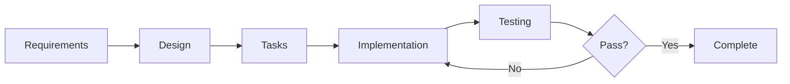

# Signature Extractor - Product Specifications

## Overview

This directory contains all product specifications, requirements, designs, and implementation plans for the Signature Extractor application. Each specification follows the EARS (Easy Approach to Requirements Syntax) and INCOSE quality standards.

## Quick Navigation

### 📋 Master Documents
- **[SPEC_OVERVIEW.md](SPEC_OVERVIEW.md)** - High-level overview of all specs, roadmap, and dependencies
- **[COMPETITIVE_ANALYSIS.md](COMPETITIVE_ANALYSIS.md)** - Market research, competitor analysis, and positioning

### 🚀 Launch-Critical Specifications

#### 1. [Pre-Launch Review](pre-launch-review/)
**Status**: In Progress | **Priority**: Critical | **Timeline**: Pre-launch

Critical review of all functionality before launch, including architecture decisions, bug fixes, and core feature validation.

- **Requirements**: ✅ Complete
- **Design**: ✅ Complete
- **Tasks**: ✅ Complete
- **Implementation**: 🔄 In Progress

**Key Focus Areas**:
- Architecture decision (hybrid local/backend)
- Critical bug fixes
- Configuration management
- Security and privacy
- Distribution packaging

#### 2. [Licensing Restrictions](licensing-restrictions/)
**Status**: In Progress (40% complete) | **Priority**: Critical | **Timeline**: Pre-launch

Implementation of trial mode restrictions and license enforcement for export and PDF operations.

- **Requirements**: ✅ Complete
- **Design**: ✅ Complete
- **Tasks**: ✅ Complete (Tasks 1-3 done, 4-7 remaining)
- **Implementation**: 🔄 40% Complete

**Completed**:
- ✅ Enhanced license validation system
- ✅ License restriction dialog
- ✅ Export operation restrictions

**Remaining**:
- ⏳ PDF operation restrictions
- ⏳ UI integration
- ⏳ Testing and validation

#### 3. [Tiered Licensing & Features](tiered-licensing-features/)
**Status**: Requirements Complete | **Priority**: Critical | **Timeline**: Pre-launch

Defines the complete licensing model with feature restrictions by tier (Trial, Basic, Professional, Enterprise).

- **Requirements**: ✅ Complete
- **Design**: ⏳ Not Started
- **Tasks**: ⏳ Not Started
- **Implementation**: ⏳ Not Started

**Feature Matrix**:
- **Trial**: Processing only, no export/signing
- **Basic ($29/year)**: PNG/JPEG export + PDF signing
- **Professional ($79/year)**: All formats + DOCX signing + batch
- **Enterprise ($299/year)**: Everything + API + integrations

### 📈 Post-Launch Enhancement Specifications

#### 4. [Advanced Export Formats](advanced-export-formats/)
**Status**: Requirements Complete | **Priority**: High | **Timeline**: v1.1

Adds professional export formats beyond PNG/JPEG.

- **Requirements**: ✅ Complete
- **Design**: ⏳ Not Started
- **Tasks**: ⏳ Not Started
- **Implementation**: ⏳ Not Started

**New Formats** (Professional tier+):
- SVG (vector graphics)
- TIFF (professional printing)
- WebP (web optimization)
- BMP (legacy compatibility)

#### 5. [Document Format Support](document-format-support/)
**Status**: Requirements Complete | **Priority**: High | **Timeline**: v1.2

Expands document signing beyond PDF to Word and other formats.

- **Requirements**: ✅ Complete
- **Design**: ⏳ Not Started
- **Tasks**: ⏳ Not Started
- **Implementation**: ⏳ Not Started

**New Formats** (Professional tier+):
- DOCX (Microsoft Word)
- DOC (Legacy Word)
- ODT (OpenDocument)
- RTF (Rich Text Format)

#### 6. [Advanced Extraction Engine](advanced-extraction-engine/)
**Status**: Requirements Complete | **Priority**: Medium | **Timeline**: v1.3

AI-powered signature extraction with improved accuracy and batch processing.

- **Requirements**: ✅ Complete
- **Design**: ✅ Complete
- **Tasks**: ✅ Complete
- **Implementation**: ⏳ Not Started

**Key Features**:
- AI/ML-based extraction
- Batch processing
- Auto-detection
- Quality scoring

#### 7. [Contextual UX Improvements](contextual-ux-improvements/)
**Status**: Requirements Complete | **Priority**: Medium | **Timeline**: v1.4

Smart UI that adapts to user context and workflow.

- **Requirements**: ✅ Complete
- **Design**: ✅ Complete
- **Tasks**: ✅ Complete
- **Implementation**: ⏳ Not Started

**Key Features**:
- Contextual controls
- Smart pane management
- Responsive design
- Keyboard shortcuts

### 🏢 Enterprise & Professional Specifications

#### 8. [Professional PDF Workflow](professional-pdf-workflow/)
**Status**: Requirements Complete | **Priority**: Medium | **Timeline**: v2.0

Advanced PDF features including digital signatures, forms, and compliance.

- **Requirements**: ✅ Complete
- **Design**: ✅ Complete
- **Tasks**: ✅ Complete
- **Implementation**: ⏳ Not Started

**Key Features**:
- Digital signatures (PKCS#12)
- PDF forms integration
- Document comparison
- Advanced annotations
- Compliance features

#### 9. [Enterprise Features](enterprise-features/)
**Status**: Requirements Complete | **Priority**: Low | **Timeline**: v2.1

Enterprise-grade features for large organizations.

- **Requirements**: ✅ Complete
- **Design**: ✅ Complete
- **Tasks**: ✅ Complete
- **Implementation**: ⏳ Not Started

**Key Features**:
- SSO integration
- RBAC (Role-Based Access Control)
- Advanced audit logging
- Enterprise deployment
- Cloud integrations

#### 10. [Team Collaboration Features](team-collaboration-features/)
**Status**: Requirements Complete | **Priority**: Low | **Timeline**: v2.2

Team-based features for shared workflows.

- **Requirements**: ✅ Complete
- **Design**: ✅ Complete
- **Tasks**: ✅ Complete
- **Implementation**: ⏳ Not Started

**Key Features**:
- Shared signature libraries
- Team templates
- Collaborative workflows
- Team management
- Usage analytics

#### 11. [Workflow Automation](workflow-automation/)
**Status**: Requirements Complete | **Priority**: Low | **Timeline**: v2.3

Automation and integration capabilities.

- **Requirements**: ✅ Complete
- **Design**: ✅ Complete
- **Tasks**: ✅ Complete
- **Implementation**: ⏳ Not Started

**Key Features**:
- API access
- Webhooks
- Workflow automation
- Integration ecosystem
- Custom scripting

## Implementation Roadmap

### Phase 1: Launch (Weeks 1-4) - CURRENT
**Goal**: Minimum viable product with licensing

**Specs**: Pre-Launch Review, Licensing Restrictions

**Deliverables**:
- ✅ Core extraction functionality
- ✅ Basic export (PNG/JPEG)
- ✅ PDF signing
- 🔄 Licensing restrictions (40% complete)
- ⏳ Payment integration
- ⏳ Distribution packaging

### Phase 2: Professional Features (Weeks 5-12)
**Goal**: Professional tier value proposition

**Specs**: Advanced Export Formats, Document Format Support, Advanced Extraction Engine

**Deliverables**:
- SVG, TIFF, WebP, BMP export
- DOCX/DOC signing
- Batch processing
- AI-powered extraction

### Phase 3: UX Polish (Weeks 8-16)
**Goal**: Refined user experience

**Specs**: Contextual UX Improvements

**Deliverables**:
- Contextual controls
- Smart UI
- Responsive design
- Performance optimization

### Phase 4: Enterprise Features (Months 4-6)
**Goal**: Enterprise tier capabilities

**Specs**: Enterprise Features, Team Collaboration, Workflow Automation, Professional PDF Workflow

**Deliverables**:
- API access
- SSO integration
- Team collaboration
- Workflow automation
- Advanced compliance

## Specification Structure

Each specification directory contains:

```
spec-name/
├── requirements.md    # EARS-compliant requirements
├── design.md         # Technical design and architecture
└── tasks.md          # Implementation task list
```

### Requirements Document
- Introduction and glossary
- User stories with acceptance criteria
- EARS pattern compliance
- INCOSE quality rules

### Design Document
- Architecture overview
- Component specifications
- Data models
- Error handling
- Testing strategy

### Tasks Document
- Numbered task list with checkboxes
- Sub-tasks with requirements references
- Optional tasks marked with *
- Implementation order

## Feature Tier Mapping

### Trial Mode (Free)
**Specs**: Licensing Restrictions

- ✅ Signature extraction and processing
- ✅ Preview and adjustment tools
- ✅ Library management
- ❌ Export operations
- ❌ PDF signing
- ❌ Document signing

### Basic License ($29/year)
**Specs**: Licensing Restrictions, Pre-Launch Review

- ✅ All Trial features
- ✅ PNG/JPEG export
- ✅ PDF signing and saving
- ✅ Clipboard operations
- ❌ Advanced export formats
- ❌ Document signing
- ❌ Batch processing

### Professional License ($79/year)
**Specs**: Advanced Export Formats, Document Format Support, Advanced Extraction Engine, Contextual UX

- ✅ All Basic features
- ✅ SVG, TIFF, WebP, BMP export
- ✅ DOCX, DOC, ODT, RTF signing
- ✅ Batch processing
- ✅ Custom templates
- ✅ Advanced extraction
- ❌ API access
- ❌ Enterprise integrations

### Enterprise License ($299/year)
**Specs**: Enterprise Features, Team Collaboration, Workflow Automation, Professional PDF Workflow

- ✅ All Professional features
- ✅ API access and webhooks
- ✅ Cloud storage integrations
- ✅ Team collaboration
- ✅ SSO and RBAC
- ✅ Advanced compliance
- ✅ Priority support

## Competitive Position

See [COMPETITIVE_ANALYSIS.md](COMPETITIVE_ANALYSIS.md) for detailed market research.

**Key Differentiators**:
1. **Signature Extraction** - Unique feature, no competitor offers this
2. **Privacy-First** - Local processing, no cloud storage
3. **Pricing** - 60-85% cheaper than competitors ($29-79 vs $96-480/year)
4. **Desktop-Native** - Better performance, works offline
5. **Flat Pricing** - No per-user fees

**Target Markets**:
- Individual professionals (50M+ freelancers)
- Privacy-conscious organizations (healthcare, legal, finance)
- Small teams (2-10 people)

## Development Guidelines

### Working with Specs

1. **Read Requirements First** - Understand user stories and acceptance criteria
2. **Review Design** - Understand technical approach
3. **Follow Tasks** - Implement in order, mark progress
4. **Test Against Requirements** - Validate each acceptance criterion
5. **Update Documentation** - Keep specs current with implementation

### Spec Workflow



### Task Execution

1. Mark task as "in_progress" before starting
2. Read all sub-tasks and requirements
3. Implement functionality
4. Test against acceptance criteria
5. Mark task as "completed"
6. Move to next task

### Optional Tasks

Tasks marked with `*` are optional (typically tests/documentation):
- Can be skipped for MVP
- Should be implemented for production
- User decides based on timeline

## Success Metrics

### Launch Success Criteria
- ✅ All critical bugs resolved
- ✅ Trial mode restrictions working
- ✅ Payment integration functional
- ✅ Distribution packages tested
- ✅ Documentation complete

### Professional Tier Success
- 📊 20% of Basic users upgrade to Professional
- 📊 SVG export used by 40% of Professional users
- 📊 DOCX signing used by 60% of Professional users
- 📊 Batch processing used by 30% of Professional users

### Enterprise Tier Success
- 📊 5% of Professional users upgrade to Enterprise
- 📊 API usage by 80% of Enterprise users
- 📊 Team features used by 90% of Enterprise users
- 📊 90% Enterprise customer retention

## Current Status Summary

| Spec | Requirements | Design | Tasks | Implementation | Priority |
|------|-------------|--------|-------|----------------|----------|
| Pre-Launch Review | ✅ | ✅ | ✅ | 🔄 In Progress | Critical |
| Licensing Restrictions | ✅ | ✅ | ✅ | 🔄 40% | Critical |
| Tiered Licensing | ✅ | ⏳ | ⏳ | ⏳ | Critical |
| Advanced Export | ✅ | ⏳ | ⏳ | ⏳ | High |
| Document Formats | ✅ | ⏳ | ⏳ | ⏳ | High |
| Advanced Extraction | ✅ | ✅ | ✅ | ⏳ | Medium |
| Contextual UX | ✅ | ✅ | ✅ | ⏳ | Medium |
| Professional PDF | ✅ | ✅ | ✅ | ⏳ | Medium |
| Enterprise Features | ✅ | ✅ | ✅ | ⏳ | Low |
| Team Collaboration | ✅ | ✅ | ✅ | ⏳ | Low |
| Workflow Automation | ✅ | ✅ | ✅ | ⏳ | Low |

## Next Steps

### Immediate (This Week)
1. Complete Licensing Restrictions implementation (Tasks 4-7)
2. Test trial mode restrictions thoroughly
3. Integrate payment system
4. Package for distribution

### Short-term (Next 2-4 Weeks)
1. Create design documents for Tiered Licensing Features
2. Create design documents for Advanced Export Formats
3. Create design documents for Document Format Support
4. Begin Professional tier feature implementation

### Medium-term (Next 1-3 Months)
1. Implement SVG export
2. Implement DOCX signing
3. Implement batch processing
4. Polish UX based on user feedback

### Long-term (3-6 Months)
1. Begin Enterprise features
2. Implement API access
3. Add team collaboration
4. Build workflow automation

## Contributing

When creating or updating specifications:

1. **Follow EARS Patterns** - Use proper requirement syntax
2. **Apply INCOSE Rules** - Ensure quality and clarity
3. **Reference Requirements** - Link tasks to acceptance criteria
4. **Update Status** - Keep implementation status current
5. **Document Decisions** - Record design rationale

## Resources

- **EARS Guide**: Easy Approach to Requirements Syntax
- **INCOSE Standards**: Requirements quality guidelines
- **Mermaid Diagrams**: For architecture and flow diagrams
- **Markdown**: For all documentation

## Questions?

For questions about specifications:
1. Check [SPEC_OVERVIEW.md](SPEC_OVERVIEW.md) for high-level context
2. Review [COMPETITIVE_ANALYSIS.md](COMPETITIVE_ANALYSIS.md) for market positioning
3. Read individual spec requirements for detailed information
4. Consult design documents for technical details

---

**Last Updated**: November 7, 2025  
**Current Phase**: Phase 1 - Launch (Week 3)  
**Next Milestone**: Complete Licensing Restrictions (Week 4)