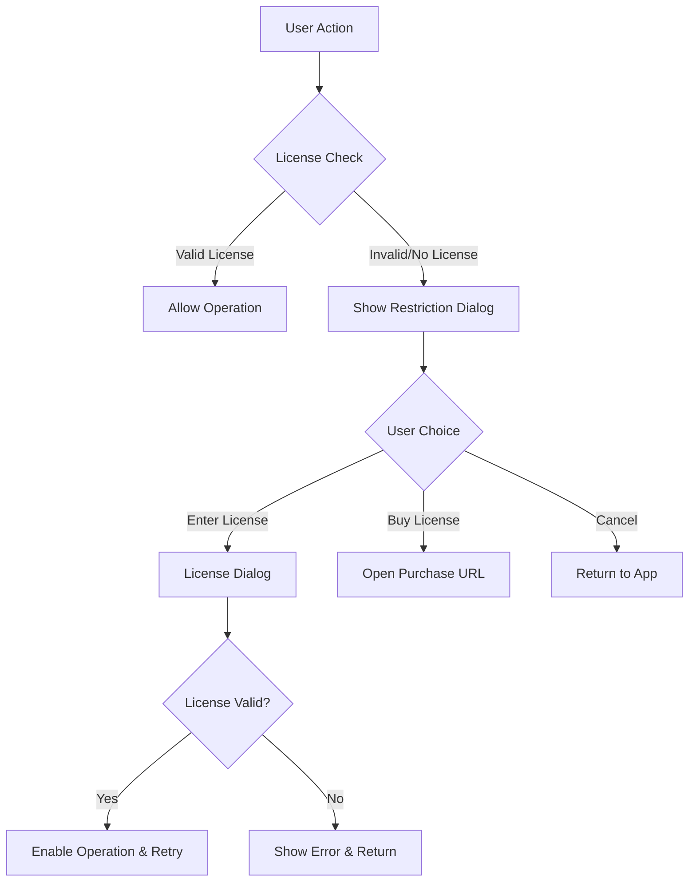
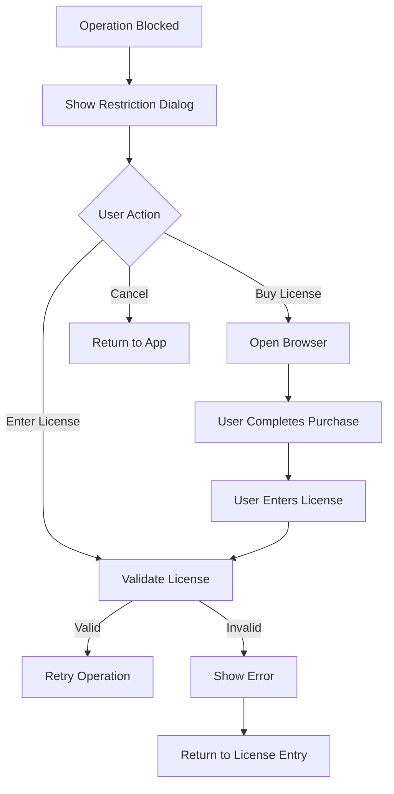

# Licensing Restrictions Design Document

## Overview

This design implements a licensing enforcement system that restricts core export and PDF operations when the application is in trial mode. The system builds upon the existing license storage infrastructure to add validation checks at key operation points while maintaining a smooth user experience.

## Architecture

### High-Level Flow



### System Integration Points

The licensing restrictions integrate with existing components:

1. **License Storage Module** (`desktop_app/license/storage.py`) - Enhanced validation
2. **Export Dialog** (`desktop_app/views/export_dialog.py`) - Pre-operation license check
3. **PDF Operations** (`desktop_app/views/main_window_parts/pdf.py`) - Paste and save restrictions
4. **Main Window** (`desktop_app/views/main_window.py`) - License status integration

## Components and Interfaces

### 1. Enhanced License Validator

```python
class LicenseValidator:
    """Enhanced license validation with test license support."""
    
    @staticmethod
    def is_operation_allowed(operation_type: str) -> tuple[bool, str]:
        """
        Check if operation is allowed under current license.
        
        Args:
            operation_type: 'export' or 'pdf_operations'
            
        Returns:
            (allowed: bool, reason: str)
        """
        
    @staticmethod
    def is_test_license(license_key: str) -> bool:
        """Check if license key is the test license."""
        
    @staticmethod
    def validate_license_key(key: str) -> bool:
        """Validate license key including test license."""
```

### 2. License Restriction Dialog

```python
class LicenseRestrictionDialog(QDialog):
    """Dialog shown when operations are restricted due to licensing."""
    
    def __init__(self, operation_name: str, parent=None):
        """
        Args:
            operation_name: Human-readable name of restricted operation
        """
        
    def setup_ui(self) -> None:
        """Setup dialog UI with clear messaging and action buttons."""
        
    def on_enter_license(self) -> None:
        """Open license entry dialog."""
        
    def on_buy_license(self) -> None:
        """Open purchase URL in browser."""
```

### 3. Operation Interceptors

#### Export Interceptor
```python
def check_export_license() -> bool:
    """
    Check license before export operations.
    Shows restriction dialog if needed.
    
    Returns:
        True if operation should proceed, False if blocked
    """
```

#### PDF Operations Interceptor
```python
def check_pdf_operations_license() -> bool:
    """
    Check license before PDF paste/save operations.
    Shows restriction dialog if needed.
    
    Returns:
        True if operation should proceed, False if blocked
    """
```

## Data Models

### Enhanced License Info

```python
@dataclass
class LicenseInfo:
    key: str
    email: Optional[str] = None
    is_test_license: bool = False
    validated_at: Optional[datetime] = None
    
    def is_valid(self) -> bool:
        """Check if license is currently valid."""
        return bool(self.key and (len(self.key) >= 6 or self.is_test_license))
```

### Operation Types

```python
class OperationType(Enum):
    EXPORT = "export"
    PDF_OPERATIONS = "pdf_operations"
```

## Error Handling

### License Validation Errors

1. **No License Present**: Show friendly trial mode message with purchase option
2. **Invalid License Format**: Show error with option to re-enter license
3. **Test License Detection**: Automatically enable all features for testing

### Operation Blocking

1. **Graceful Degradation**: Block only restricted operations, maintain preview functionality
2. **Clear Messaging**: Explain what's restricted and why
3. **Easy Recovery**: Provide immediate license activation path

### Error Recovery Flow



## Testing Strategy

### Unit Tests

1. **License Validator Tests**
   - Test license validation logic
   - Test test license recognition
   - Test operation permission checks

2. **Dialog Tests**
   - Test restriction dialog display
   - Test user action handling
   - Test license entry integration

### Integration Tests

1. **Export Restriction Tests**
   - Test export blocking in trial mode
   - Test export enabling with valid license
   - Test test license functionality

2. **PDF Operations Tests**
   - Test PDF paste blocking in trial mode
   - Test PDF save blocking in trial mode
   - Test full functionality with license

### Test License Scenarios

1. **No License**: All restricted operations blocked
2. **Test License ("pranay@example.com")**: All operations allowed
3. **Valid License**: All operations allowed
4. **Invalid License**: Operations blocked with error message

## Implementation Details

### Integration Points

1. **Export Dialog Enhancement**
   - Add license check before showing export dialog
   - Show restriction dialog if license invalid

2. **PDF Operations Enhancement**
   - Add license check before paste operations
   - Add license check before save operations
   - Maintain preview functionality in trial mode

3. **UI Indicators**
   - Show trial mode status in interface
   - Update menu items based on license status
   - Provide license activation shortcuts

### Configuration

```python
# Test license configuration
TEST_LICENSE_EMAIL = "pranay@example.com"
PURCHASE_URL = "https://gumroad.com/l/signature-extractor"  # Example URL

# Restriction messages
EXPORT_RESTRICTION_MESSAGE = "Export functionality requires a license. You can still preview and process signatures in trial mode."
PDF_RESTRICTION_MESSAGE = "PDF signing and saving requires a license. You can still view PDFs and preview signature placement in trial mode."
```

### Backward Compatibility

- Existing license storage format maintained
- Existing license validation enhanced, not replaced
- Graceful handling of existing installations without licenses

## Security Considerations

1. **Client-Side Validation**: Current implementation uses client-side validation suitable for desktop application
2. **Test License Security**: Test license only enabled in development/testing scenarios
3. **License Storage**: Existing secure local storage maintained
4. **No Network Dependency**: Offline license validation preserved